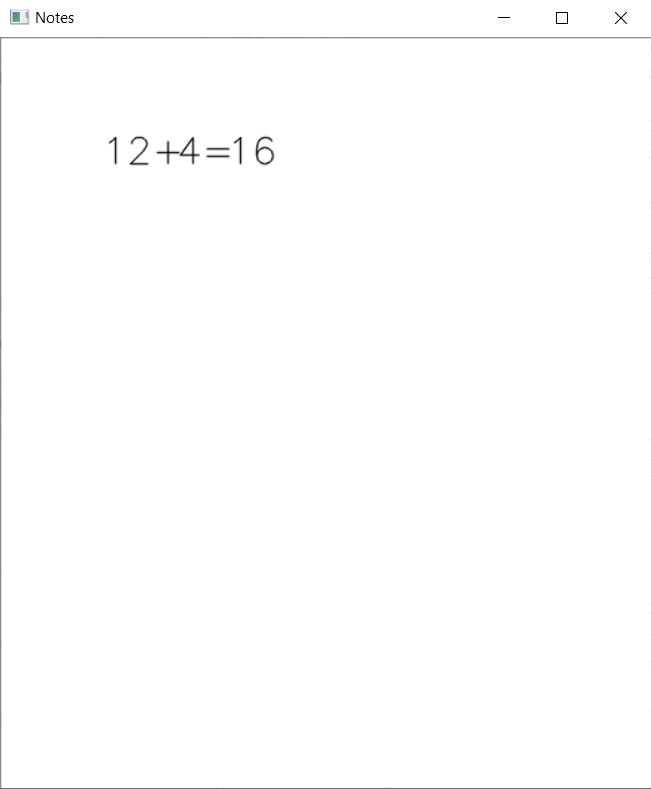
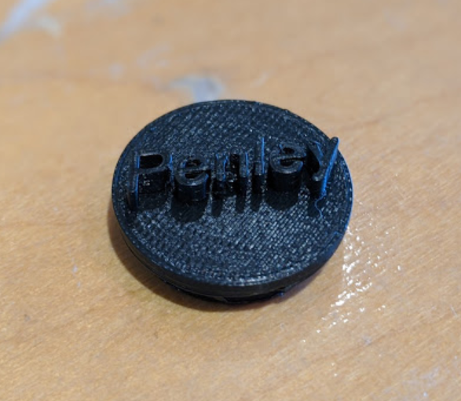
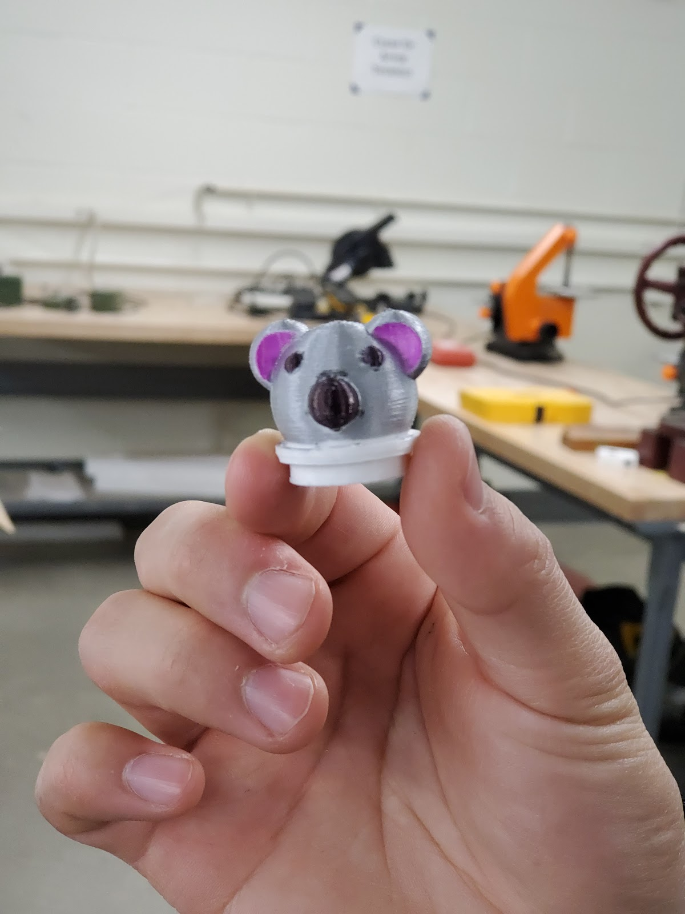
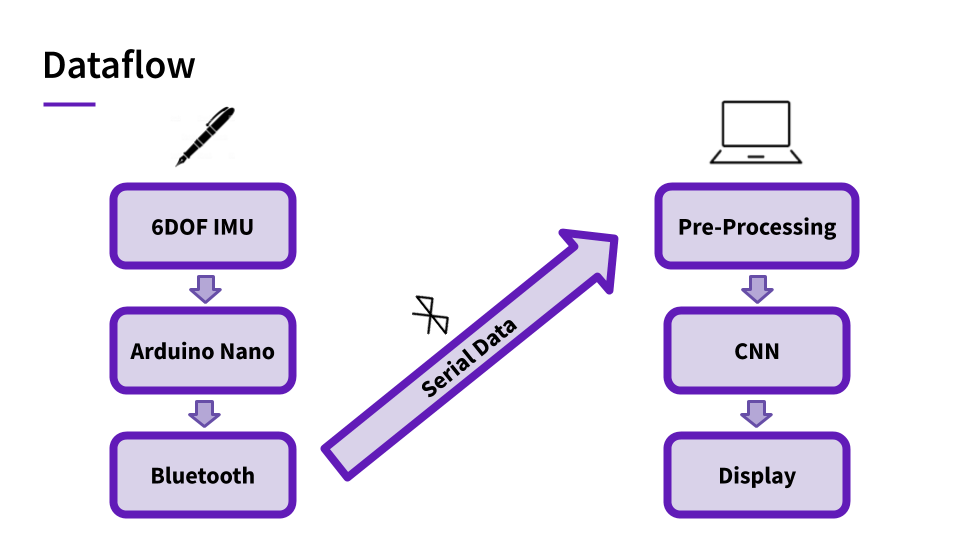
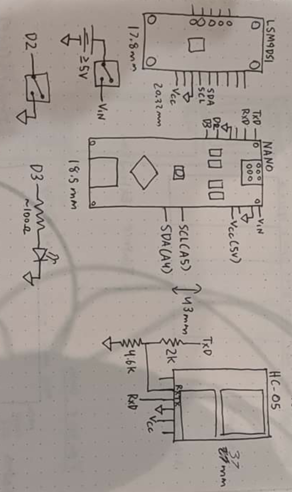

# Penley: A Smart Pen

  

Penley is a smart-pen device that can recognize handwritten digits using pen motion. It was built in 36 hours at IDEA Hacks 2020, achieving 2nd place. 

Note: Please excuse the shoddy documentation of code -- this project was built with the highly myopic intent of rapid completion for the hackathon. We hope this project will inspire others to build similar smart-pen devices that can recognize a variety of characters with a more elegant and robust user-interface.

## Introduction 

  

Penley is a smart-pen device that enables the user to transribe handwritten notes into computer-transribed notes in real-time. It works soley by tracking the motion of the pen and classifying characters using a deep-learning framework.

  
  

  
  

## How it works

  

### Hardware

  

### Software 

## Getting Started

### Setting up 

### Obtaining training data 

### Testing 

## Future Work 

## Credits 
