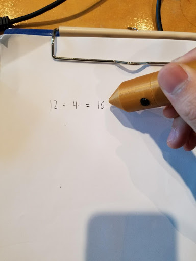

# Penley: A Smart Pen

  

Penley is a smart-pen device that can recognize handwritten digits using pen motion. It was built in 36 hours at IDEA Hacks 2020, achieving 2nd place. 

The project was built with the highly myopic intent of rapid completion for the hackathon. Currently, the device is only capable of recognizing a few digits with mildly decent accuracy. We hope this project will inspire others to build similar smart-pen devices that can recognize a variety of characters with a more elegant and robust user-interface.

## Introduction 

  

  
  

Penley is a smart-pen device that enables the user to transribe handwritten notes into computer-transribed notes in real-time. It works soley by tracking the motion of the pen and classifying characters using a deep-learning framework.

  
  

As a result, Penley can write notes on any surface. No special tablet, paper or ink is required for Penley to work -- it only requires a device capable of running our note-taking app and connecting via Bluetooth or USB. This makes Penley both extremely cheap and environmentally friendly. 

  
  

Penley was also designed to have interchangable caps. You can personalize your pen to support what matters to you the most. 

## How it works

  

The design of Penley is quite simple. A internal-measurement-unit (IMU) tracks the pen's motion and transmits the data to a microcontroller, which simply relays the information to our note-taking app via Bluetooth or USB serial-communication. The motion data is then pre-processed and fed into a convolutional neural network (CNN) for character classification. The results are displayed on a very basic UI. 

### Hardware

  

The schematics for the hardware are given in the above diagram. Yes, we know its not a CAD schematic. We had 36 hours, and we didn't want to waste time making things look pretty. Except for the Koala bear cap. That was awesome. 

Parts list: 
* Arduino Nano
* 9DOF IMU LSM9DS1 (only required 6 DoF: accelerometer \& gyroscope)
* HC-05 Bluetooth module
* 3V Li battery coin cells CR 2032
* SPDT switches 
* Resistors: 100, 2k, 4.6k 
* LED 
* Wires 
* 3D printer (for housing)

### Software 

## Getting Started

### Setting up 

### Obtaining training data 

### Testing 

## Future Work 

## Credits 
