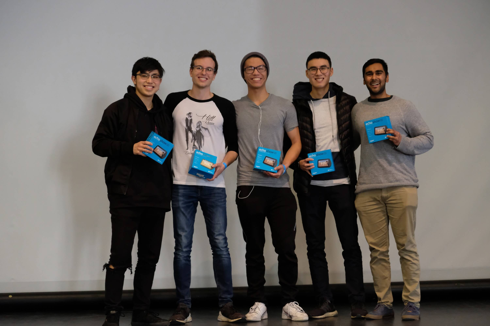

# Penley: A Smart Pen

  

Penley is a smart-pen device that can recognize handwritten digits using pen motion. It was built in 36 hours at IDEA Hacks 2020, achieving 2nd place. 

The project was built with the highly myopic intent of rapid completion for the hackathon. Currently, the device is only capable of recognizing a few digits with mildly decent accuracy. We hope this project will inspire others to build similar smart-pen devices that can recognize a variety of characters with a more elegant and robust user-interface.

## Introduction 

  

  
  

Penley is a smart-pen device that enables the user to transribe handwritten notes into computer-transribed notes in real-time. It works soley by tracking the motion of the pen and classifying characters using a deep-learning framework.

  
  

As a result, Penley can write notes on any surface. No special tablet, paper or ink is required for Penley to work -- it only requires a device capable of running our note-taking app and connecting via Bluetooth or USB. This makes Penley both extremely cheap and environmentally friendly. 

  
  

Penley was also designed to have interchangable caps. You can personalize your pen to support what matters to you the most. 

## How it works

  

The design of Penley is quite simple. A internal-measurement-unit (IMU) tracks the pen's motion and transmits the data to a microcontroller, which simply relays the information to our note-taking app via Bluetooth or USB serial-communication. The motion data is then pre-processed and fed into a convolutional neural network (CNN) for character classification. The results are displayed on a very basic UI. 

### Hardware

  

The schematics for the hardware are given in the above diagram. Yes, we know its not a CAD schematic. We had 36 hours, and we didn't want to waste time making things look pretty. Except for the Koala bear cap. That was awesome. 

Parts list: 
* Arduino Nano
* 9DOF IMU LSM9DS1 (only required 6 DoF: accelerometer \& gyroscope)
* HC-05 Bluetooth module
* 3V Li battery coin cells CR 2032
* SPDT switches 
* Resistors: 100, 2k, 4.6k 
* LED 
* Wires 
* 3D printer (for housing)

### Software 

The hardware-side software was written in C++ for the Arduino. The computer/app-side software was written in Python 3.6. Deep learning was enabled with TensorFlow 1.x and Keras stand-alone. 

The CNN architecture used was very simple and naive -- it only utilized 1 convolutional layer, followed by a max-pooling layer, followed by a fully-connected-network with dropout. We utilized ReLU activations and an output Softmax activation. The ADAM optimizer was used. This was our first real-exposure to deep learning, and our model reflects as such. Much work is needed on the neural network architecture and data pre-processing, and serves as a very interesting research direction.  

## Getting Started

TO-DO: Update 'Getting Started' with images that document the process of loading Arduino code, collecting training data, training the CNN and, finally, using the Penley. 

### Setting up 

(1) Assemble the Penley hardware using schematic above. 

(2) Compile and load the [IMU_GY_521.ino](arduino/IMU_GY_521/IMU_GY_521.ino) Arduino file onto the Arduino. Ensure the value of BUTTON is set to the corresponding digital pin that is connected to your physical writing push-button.  

(3) Connect to your bluetooth module.  

(4) Test whether your device is successfully receiving Penley motion data by running the [read_serial.py](read_serial.py) file. The file should be exited via a keyboard interrupt to ensure serial-communication is properly closed.

### Obtaining training data 

(5) To collect training data, run the [record_dataset.py](record_dataset.py) file. 

(6) After successfully initiating communication with the Penley, the script will prompt 2 user inputs: 
(i) The user should enter a valid integer to specify how many samples they would like to record, 
(ii) The user should enter a string to specify a filename in which the training data will be saved within.  

(7) The script will begin to output random integers between 0-9. The user should use the Penley to write the outputted numbers. Remember to hold the push button when writing the digit, and releasing only once the digit has been completely written. The script will prompt the user if there is a recording error, in which case the displayed digit should be written again.  

(8) After completion, the script will automatically exit. Otherwise, the user can end the script early via a keyboard interrupt. Currently, this will not save the recorded data. 

### Training 

(9) Run the [train_model.py](train_model.py) to train the model with the training dataset. The user should manually input the path location for the training dataset.  

### Testing 

(10) Run the [main.py](main.py) file. After writing your first digit, a display window will appear. Hopefully, it will display the correct digit you wrote! You can keep writing digits, and the display will continue to output what it thinks you wrote. You can exit the program via a keyboard interrupt. 

## Future Work 

As aforementioned, this project was created in 36 hours with the intent of showing the basic idea working. There is plenty of room for debugging and development, and it is heavily encouraged to anyone who comes across this project. Here is a big list of large-scale items that can be completed to help Penley become a viable device:  

* Construct new pre-processing tools.
* Construct new neural network architectures for higher accuracy classification
* Implement method of reading spaces and line/page breaks. 
* Implement reading both characters and digits
* Implement deciphering whole words and sentences without breaks from a stream of IMU data. 
* Construct a better UI

## Credits 

Krish Kabra - [krishk97](https://github.com/krishk97)

Aidan Cookson - [aucookson97](https://github.com/aucookson97)

Daniel Truong - [danthedolphin](https://github.com/danthedolphin)

Max Gong - [maxg](https://github.com/maxg)

Calvin Chang - [LemonCakeXD](https://github.com/LemonCakeXD)

  

